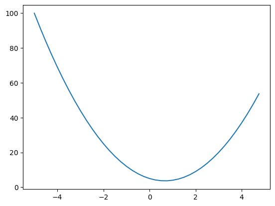

# [Micrograd](https://youtu.be/VMj-3S1tku0?si=EpDtCDZ-rv9ClTwC)

Attempting to follow Andrej's wonderful tutorial and implement in mojo lang (v.2023-08-24)

### engine.mojo

Derivative of a simple function


```mojo
from math import mul
from python import Python
from python.object import PythonObject
let np = Python.import_module("numpy")
let plt = Python.import_module("matplotlib.pyplot")
let colors = Python.import_module("matplotlib.colors")
```


```mojo
fn f(x: Float32) -> Float32:
    return 3*x**2 - 4*x + 5
```


```mojo
let xs = np.arange(-5.0, 5.0, 0.25)
var ys = np.array((), np.float32)
 
for x in xs:
    ys = np.append(ys, f(x.to_float64().cast[DType.float32]()))

plt.plot(xs, ys)
plt.show()
```


    

    


    


```mojo
h = 0.001
x = 3.0
print((f(x+h)-f(x))/h)
```

    14.001845359802246


### nn.mojo


```mojo

```

